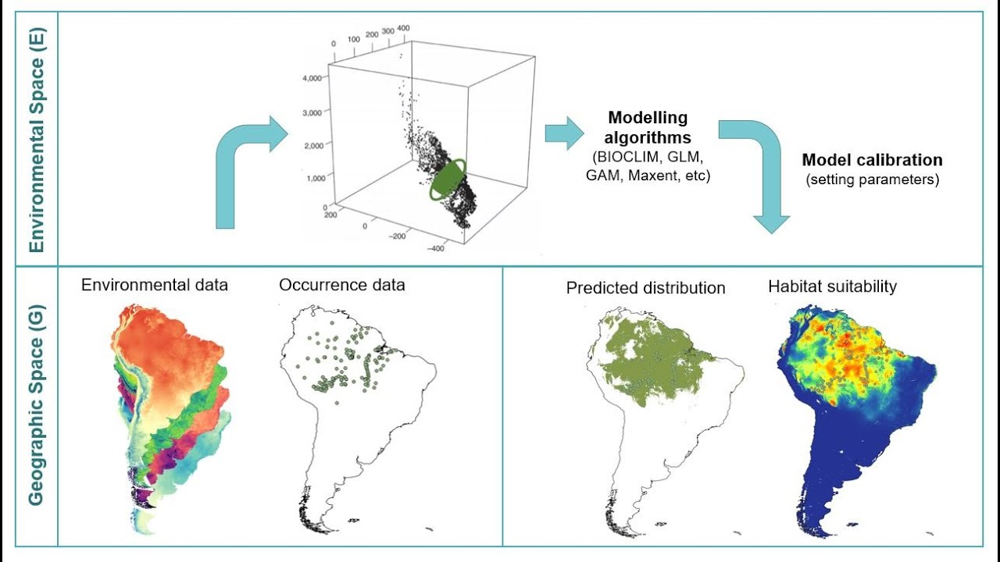

  
### ***Spatial model distribution***

To predict the probability of geographic occurrence for each landrace group, we generated MaxEnt models using the ‘maxnet’ R package. Group-specific spatial predictors were selected using a combination of the variance inflation factor (VIF) and a principal component analysis (PCA) to control for excessive model complexity and variable collinearity. We removed variables that did not contribute significantly to the variance in the PCA, defined as contributing less than 15% to the first component, and we further discarded variables with a VIF>10.

MaxEnt models were fitted through five-fold (K=5) cross-validation with 80% training and 20% testing. For each fold, we calculated the area under the receiving operating characteristic curve (AUC), sensitivity, specificity and Cohen’s kappa as measures of model performance. To create a single prediction that represents the probability of occurrence for the landrace group, we computed the median across K models. Geographic areas in the form of pixels with probability values above the maximum sum of sensitivity and specificity were treated as the final area of predicted presence.

